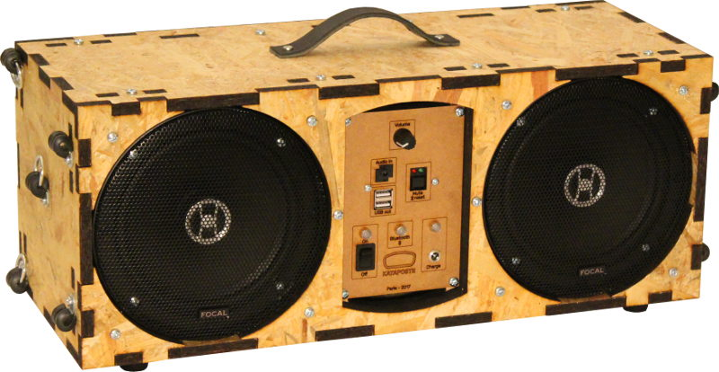

Kataposte 165
=============

Français
--------

Ce dépôt contient les plans du Kataposte 165 sous forme de [SVG Inkscape](src/kataposte-165.svg).

Ils peuvent être utilisés selon les termes de la licence Creative Commons
avec attribution. Toute nouvelle création utilisant ces plan
s'inscrit dans le projet Kataposte qui doit être cité. Le reste est libre.
Les variations de formes et de fonctionalités sont encouragées.

De plus, afin de permettre à n'importe qui de créer soit
une coque différente, soit des fonctionalités différentes autour de haut-parleurs
de 165mm de diamètre, nous avons créé une interface simple entre ces parties.
Cette spécification d'interopérabilité est détaillée dans le fichier
[SPEC-D-INTEROPERABILITE.fr.md](SPEC-D-INTEROPERABILITE.fr.md)

English
-------

Translation comming soon.

Español
-------

Traducción en curso.

Licen[ce|se|cia]
----------------

© Kataposte 2017 - 2018

CC BY 4.0
